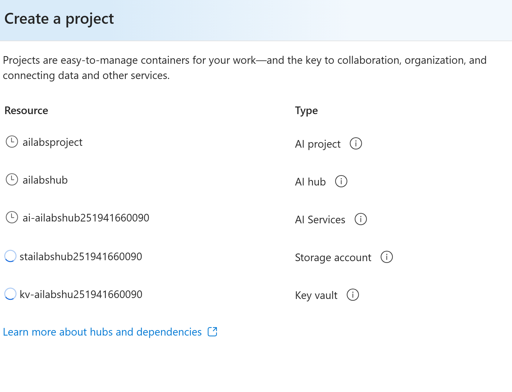
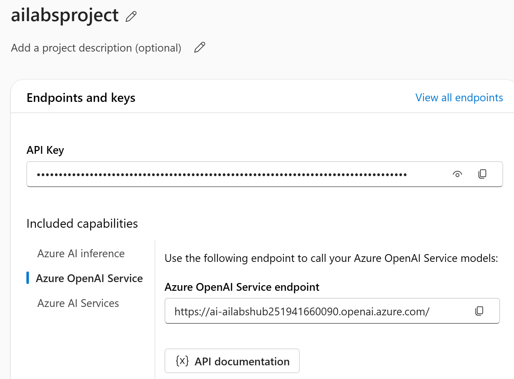
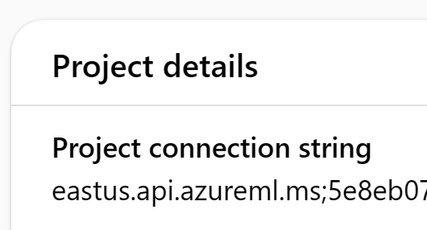
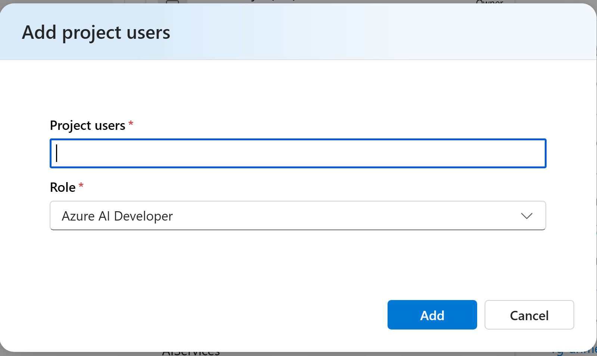

- [Create AI Foundry and Project](#create-ai-foundry-and-project)
  - [Setup Steps](#setup-steps)
- [Software Requirements](#software-requirements)

## Create AI Foundry and Project

To get started with building AI agents and applications, you will need to set up an environment in Azure AI Foundry. This platform provides tools and services for developing, deploying, and managing intelligent agents that can interact with users and perform tasks using natural language processing and AI capabilities.

### Setup Steps

1. **Initial Access**
    - Visit https://ai.azure.com/ and sign in

2. **Project Creation**
    - Click on "Create Project"
    - Enter a project name (e.g., `ailabsproject`)

3. **Hub Setup**
    - Click on "Create New Hub"
    - Provide a hub name (e.g., `ailabshub`)
    - Click "Next"
    - Accept default settings
    - Click "Create"
    - Wait for validation and creation to complete

 

4. **Collect Important Information**
    - Copy the following for later use:
      - API Key
      - Azure OpenAI Service Endpoint
      - Project connection string

5. **User Management**
    - Navigate to Management Center
    - Add additional users with "AI Developer" role

6. **Model Deployment**
    - Click on "Models and Endpoint" in the left navigation
    - Create a deployment of the gpt-4 model
    

7. **Cognitive Services OpenAI User Permissions**
    - In Azure Portal, navigate to the Azure AI Service resource
    - Go to IAM settings
    - Assign the role "Cognitive Services OpenAI User" to the user associated with the Azure AI Project
  
8. **Setup Bing Grounding**
    - Create a Bing Grounding resource in Azure AI Project
    - Create a Bing Grounding tool connection
    - Refer to [Bing Grounding](../bing_grounding.md) for more information
- 
## Software Requirements

Before proceeding with the labs, ensure you have the following software installed:
- Python 3.8 or higher
- Azure CLI
- Visual Studio Code
- Git
- .NET SDK 8.0 or higher