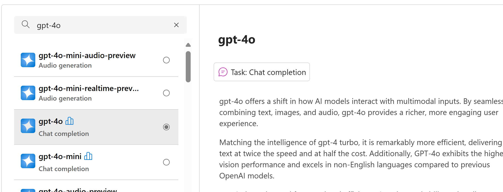

- [Create AI Foundry and Project](#create-ai-foundry-and-project)
  - [Setup Steps](#setup-steps)
- [Software Requirements](#software-requirements)

## Create AI Foundry and Project

To get started with building AI agents and applications, you will need to set up an environment in Azure AI Foundry. This platform provides tools and services for developing, deploying, and managing intelligent agents that can interact with users and perform tasks using natural language processing and AI capabilities.

### Setup Steps

1. **Initial Access**
    - Visit https://ai.azure.com/ and sign in

2. **Project Creation**
    - Click on "Create Project"
    - Enter a project name (e.g., `ailabsproject`)

3. **Hub Setup**
    - Click on "Create New Hub"
    - Provide a hub name (e.g., `ailabshub`)
    - Click "Next"
    - Accept default settings
    - Click "Create"
    - Wait for validation and creation to complete

 

4. **Collect Important Information**
    - Copy the following for later use:
      - API Key
      - Azure OpenAI Service Endpoint
      - Project connection string

5. **User Management**
    - Navigate to Management Center
    - Add additional users with "AI Developer" role

6. **Model Deployment**
    - Click on "Models and Endpoint" in the left navigation
    - Click on "Deploy model" and select "Deplopy base model"
    - Select the `gpt-4o` model from the list
    - Click "Confirm"
    - Accept the defaults and click "Create resource and deploy"
    

7. **Cognitive Services OpenAI User Permissions**
    - In Azure Portal, navigate to the Azure AI Service resource
    - Go to IAM settings
    - Assign the role "Cognitive Services OpenAI User" to the user associated with the Azure AI Project
  
8. **Setup Bing Grounding**
    - Create a Bing Grounding resource in Azure AI Project
    - Create a Bing Grounding tool connection
    - Refer to [Bing Grounding](../bing_grounding.md) for more information

## Software Requirements

Before proceeding with the labs, ensure you have the following software installed:
- Python 3.8 or higher
- Azure CLI
- Visual Studio Code
- Git
- .NET SDK 8.0 or higher

## Permissions Required

As a user executing the labs, review the below to determine which permissions you will require:
- To create a new AI Hub, you will need the **Owner** or **Contributor** role on the *resource group* where the hub is created.
    - NOTE: If you want to use a Bicep template to create the AI Hub and related resources, excluding the AI Project, head over to [Use an Azure Resource Manager template to create an Azure AI Foundry hub](https://learn.microsoft.com/en-us/azure/ai-foundry/how-to/create-azure-ai-hub-template?tabs=cli) for guidance.
- To create an AI Project in an existing AI Hub, the **Azure AI Developer** role is required on the *AI Hub resource*.
- To work on an existing AI Project, the **Azure AI Developer** role is required on the *AI Project resource*, and the **Reader** role is required on the *AI Hub* resource.
- To deploy a model in an existing AI Project, the **Azure AI Developer**, **Cognitive Services OpenAI Contributor**, and **Cognitive Services User** roles are required on the *AI services* resource.
    - NOTE: The documentation at https://learn.microsoft.com/en-us/azure/ai-foundry/concepts/rbac-azure-ai-foundry states that the Azure AI Inference Deployment Operator role is required, but this is not sufficient.
- To create a "Grounding with Bing Search" resource, the **Owner** or **Contributor** role is required on the *resource group*.
- In AI Foundry, to be able to create a connection to a "Grounding with Bing Search" resource, the **Contributor** role is required on the *Grounding with Bing Search resource*, or a custom role will need to be created and assigned, with the Microsoft.Bing/accounts/listKeys/action permission.